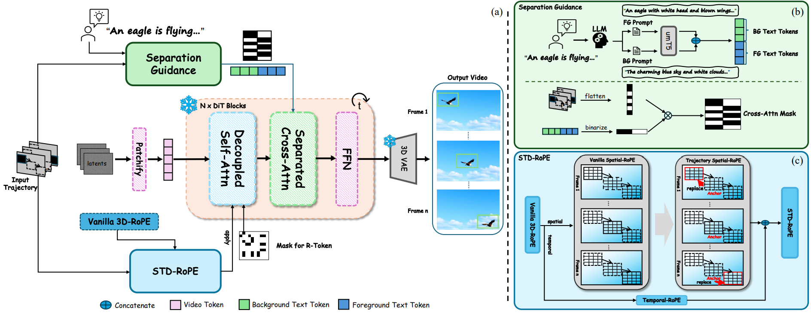

<div align="center">
<h2>DiTraj: Training-free Trajectory Control For Video Diffusion Transformer</h2>

[Cheng Lei](https://github.com/leichengjiayou)<sup>12†</sup>, [Jiayu Zhang](https://github.com/xduzhangjiayu)<sup>2†‡</sup>, [Yue Ma](https://mayuelala.github.io/)<sup>3*</sup>, [Xinyu Wang]()<sup>4</sup>, [Long Chen]()<sup>2</sup>, [Liang Tang]()<sup>2</sup>, [Yiqiang Yan]()<sup>2</sup>, [Fei Su]()<sup>1</sup>, [Zhicheng Zhao]()<sup>1*</sup>

<sup>1</sup> Beijing University of Posts and Telecommunications,  <sup>2</sup> Lenovo,  <sup>3</sup> HKUST,  <sup>4</sup> Tsinghua University

†Equal Contribution &emsp; ‡ Project Lead &emsp; *Corresponding Author


<a href='https://xduzhangjiayu.github.io/DiTraj_Project_Page/'></a> 
[](https://arxiv.org/abs/2509.21839)
[](https://github.com/xduzhangjiayu/DiTraj)


</div>

<p>
We propose <strong>DiTraj</strong>, a training-free trajectory control framework for DiT-based video generation model. Our method achieves state-of-the-art performance in both video quality and trajectory controllability. It can be adapted to most DiT-based video generation models (Wan2.1, CogVideoX etc.).
</p>

# 📖 Pipeline
<p>
<div align="center">

<div>
<div align="left">
<div>
<div>

<div align="left">
<div>
<div>

# 🔥 News
[2025.9.29] Paper released!


<div>
<div>

# 🖋️ Citation

If you find our work helpful, please **star 🌟** this repo and **cite 📑** our paper. Thanks for your support!
```
@misc{lei2025ditrajtrainingfreetrajectorycontrol,
      title={DiTraj: training-free trajectory control for video diffusion transformer}, 
      author={Cheng Lei and Jiayu Zhang and Yue Ma and Xinyu Wang and Long Chen and Liang Tang and Yiqiang Yan and Fei Su and Zhicheng Zhao},
      year={2025},
      eprint={2509.21839},
      archivePrefix={arXiv},
      primaryClass={cs.CV},
      url={https://arxiv.org/abs/2509.21839}, 
}
```